It's an allocator.  A little messy; has a test suite and that's about all.
Don't use it.  It likely contains bugs.

Ordinary release builds intentionally disable most safety and bounds checks.
The `hardened` feature retains allocator canaries, deterministic zeroing,
bounds checks, and ownership assertions in optimized builds. Any misuse of the
low-level unsafe API is still UB; this is a base on which a less risky API is
meant to go.

Qen is an explicit engine-memory allocator, not a Rust `#[global_allocator]`.
Its metadata uses ordinary Rust collections, so self-hosting would recursively
allocate while initializing or growing that metadata. Keep jemalloc, the system
allocator, or another bootstrap-safe allocator as the process global allocator;
initialize `GlobalBinnedAllocator` during startup and route controlled engine
allocations through its explicit API.

This uses a very large amount of unsafe rust.  Because it's an allocator.  It
has a fine test suite, is model-checked via loom, and checks UB under miri.
See Verification below for exactly what each of those does and does not cover.

Supports only 64-bit targets and the nightly pinned in `rust-toolchain.toml`.
Do not run it on 32-bit
targets or those without an instruction for 128-bit atomic CAS.  It will be
slow.

Operates on the assumption that cycles are often wasted, RAM is plentiful
but dog-slow, and therefore cache-friendliness is everything.  Secondly, avoid
stopping the world via global contention because if I wanted lousy tail latency
I'd just use a GC.

This is why the old method of metadata in front of a block is now wrong for
specific access patterns like simulation/ECS.  Hot path is data -> data -> data
and cold path, infrequently during sync points, is meta -> meta -> meta.  So,
keep metadata separately.  Here, all metadata for a block fits into a single u64.
This means 8 blocks metadata per cache line; alloc/free don't take up too many.

Uses a three-level hierarchical bit-tree, a la Unreal MallocBinned but static
size and so therefore limited to 16,384 blocks per 2KB tree.  Becauase of this
constraint, simply chain when capacity exceeded.  Unlike dynamic, finding
first free block is O(1) via tzcnt or similar instructions for blocks >=16KB;
amortized O(1) for smaller.

Global recycler is lock-free though technically not wait-free.  It's technically
achievable (cf. Crystalline-W, Nikolaev '21) but often slower.  Use a lock-free
Trieber stack with ABA guarded by 128-bit CAS (thanks modern architectures);
64-bit ptr + 32-bit generation + 32-bit bundle count packed in one word.  The
count rides in the CAS deliberately: a separate counter races with detach
(reset lands after the slot reopens to pushes) and quietly unbinds the
occupancy cap.  Seems the whole hyaline family and subsequent crystalline
do not outperform here.  Threads only touch global lock when recycler is full.
Sharded 4 ways per size class (2 under loom, so the cross-shard paths still
get model-checked).

Thread-local caches are dense per-class pointer stacks in one lazily-paged
slab per thread: push/pop are a single indexed store/load, and the
allocator never reads or writes the object's own memory on the fast path —
no intrusive links, no dependent-load pop chains, no cold-line touches
(link words survive only on the recycler's overflow/orphan chains). The
TLS handle is a raw `#[thread_local]` static (nightly), not `LocalKey` —
measured at a third of the hot pair. Transfers between caches and the
global tier move as dense batches through a per-class depot (one memcpy
each way, `try_lock`-only: contention degrades to the lock-free recycler
rather than ever parking). Pool refills write computed addresses straight
into the cache's slots — a bump-path refill touches no bin memory at all.

`free` works without a size: pools live in reserved-size-aligned spans, so
the pointer's masked base resolves its size class from an L1-resident
table (`try_free_ptr`). The sized API skips even that. Where tcmalloc
answers the same question with a pagemap radix walk, here the address is
the metadata.

Cache flushing is co-operative; `trim` increments an atomic gen ctr and threads
flush themselves.

Syscalls do not happen while a pool lock is held.  Commit uses a two-phase
probe/integrate protocol (probe under the lock, mprotect outside it,
reintegrate under the lock); trim/decommit mirrors it — begin_trim detaches
fully-empty blocks under the lock (hidden from the bit tree, flagged
`decommitting`), madvise runs unlocked, finish_trim reintegrates.  The one
remaining exception is the cold huge-page/over-aligned path in the large
cache, which syscalls under its own rarely-contended mutex.

Fully-empty blocks survive `decommit_cooldown` trim passes (trailing blocks
included) before their pages go back to the OS, so bursty workloads don't
thrash madvise.

Uses huge pages by default, falling back to smaller sizes if unavailable.
1GB -> 2MB -> system default.

# Verification

- `cargo test` — full suite, all platforms the crate builds on.
- `RUSTFLAGS="--cfg loom" cargo test --lib --release` — loom model checks of
  the lock-free structures (recycler, node pool, bucket stacks) and the
  trim/alloc protocols.  These run the exact shipping algorithms — no mutex
  stand-ins.  CAS-loop tests use `preemption_bound(2)` (standard bounded
  model checking).  The one thing loom cannot see is the global singleton's
  one-shot init (its OnceLock shim wraps a std mutex; see `sync.rs`), so
  loom tests exercise instance-based allocators.
- `cargo miri test` — passes with no extra flags, leak check included.
  Under miri (and loom) the VM layer is a heap-backed mock: it cannot make
  access-after-decommit fault, but it panics on protocol violations
  (commit/decommit outside a live reservation, decommit of uncommitted
  ranges, mismatched release).  The 128-bit tagged stacks inherently round-
  trip pointers through integers, so miri runs those with exposed
  provenance rather than strict. Native high-thread-count stress cases are
  ignored under the interpreter; their synchronization protocols are covered
  by the loom models, while focused allocator paths still run under miri.
- The real protection boundary is verified by subprocess fault tests on Linux
  and Windows
  (`test_decommitted_memory_faults_on_*`, `test_released_memory_faults_on_read`):
  the test binary re-executes itself, the child touches decommitted or
  released memory, and the parent asserts it died of an access violation
  (SIGSEGV/SIGBUS, or STATUS_ACCESS_VIOLATION on Windows). Children have a
  ten-second deadline. These tests are ignored on macOS because its crash
  handling can leave intentional access-fault processes unkillable for minutes.
- `--features stats` / `--features hardened` build and test in every ordinary
  combination. Loom runs the default and `stats` configurations; `hardened`
  changes validation rather than synchronization and has a separate optimized
  release test. It keeps the debug-mode canaries, deterministic zeroing, bounds
  checks, and ownership assertions active in release builds.
- VM syscall failures (commit/decommit/release refusing) are covered by a
  test-only fault-injection layer in `vm.rs`.

# Benchmarks

Measured against mimalloc, jemalloc, tcmalloc (gperftools), snmalloc,
rpmalloc, and the system allocator with rpmalloc-benchmark — method,
graphs, before/after data, and honest caveats in
[bench/RESULTS.md](./bench/RESULTS.md), including the disclosure that all
pre-2026-07-07 multi-thread numbers were capped by a bug in our own
benchmark adapter (not qen).  Short version, clean data: lowest peak RSS
of every allocator except gperftools tcmalloc, in every scenario at every
thread count; single-threaded, second only to gperftools tcmalloc in four
of five scenarios (ahead of mimalloc/snmalloc/rpmalloc once sizes pass
~1KB); at 16 threads, second or third of the field past 1KB sizes —
1.2–1.4× behind rpmalloc, ahead of tcmalloc everywhere its central
free-list collapses — with the smallest-size scenario the one remaining
scaling gap.  The road to internal (google/) tcmalloc — per-CPU rseq
caches, transfer cache, hugepage-aware backend — is scoped in
[bench/ROADMAP-sota.md](./bench/ROADMAP-sota.md).

# Architecture

# TODO

Recycler holds up correctly under cross-thread frees but gives back scaling
vs rpmalloc/snmalloc at 16 threads (~8-11 Mops/CPU-s vs 24-52).  Suspects:
shard count (4), bundle cap, and the pool-mutex fallback once the recycler
saturates.  Worth profiling before touching.

The masked-base class table now supports size-free frees for pool allocations.
Large and over-aligned allocations still require their layout; consider whether
a sharded side-metadata design is worth its extra cache-line touches if a fully
unsized public API becomes important.

Pretty sure true wait-free guarantee on the recycler would cost more than it
returns perf-wise vs. existing lock-free.
Want to tune recycler cap and bundle size pretty carefully so as to avoid
backpressure through locked path.  Could possibly use a per-thread remote queue
to further reduce global contention under asymmetric workloads.  Don't think I
want to go full snmalloc message passing.

I really don't want to mess around with ARM MTE.  Yeah security etc but come on.

Currently I decommit whole empty blocks and trim trailing empty which is lower-
risk, but perhaps take a look at Mesh, which has an interesting compaction
strategy of moving things to another page with space then using vmem to remap
the old page's address space, finally returning old physical page to OS.  Unsure
if this even works on anything besides Linux, or if it could be made to, and
don't care to go do another deep dive into vmem right now to check.
Not sure I like this, though, since necessarily has some form of locking
(believe mesh does it with protect + write fault handler that waits) that will
mess with tail latencies.  "Now you can write in a systems language and still
enjoy the benefits of GC latency spikes!" gee thanks.  Not nearly as bad but
still likely shows in p99.

Google did some interesting work with tcmalloc on tuning via LSTM; could be
interesting but want to make sure  I don't thrash everything to death with
constant config tweaks.  Also don't want to force checking atomics all the time
in the hot path.  Maybe go expose an API for this and check config infrequently
at coarse cadence.  Keep param space small; maybe bounds and hysteresis.

Currently 128-bit atomic (ptr + generation (curse you red baron (rust core team)
for making gen a keyword)) prevents using `LDAPR` (ARM 8.3+ instruction with
somewhat weaker guarantees and better performance for mem barrier).  CASP
probably dominates anyway though not LDAR vs LDAPR.  Not acquiring loads of
shared read-mostly state in tight loops; it's fine.

Considered rejiggering API surface to allow multiple TLCs but this is a rare
use-case and would make it very ugly.  Passing `&mut cache` to every alloc is
annoying.  Probably skip.
