It's an allocator.  A little messy; has a test suite and that's about all.
Don't use it for anything that matters unless you want to run the risk of
bugs.

Intentionally disables just about every safety/bounds check/panic in
release.  Better performance but no fun to debug.  Any misuse ever at all is UB.
This is a base on which a less risky API is meant to go.

This uses a very large amount of unsafe rust.  Because it's an allocator.  It
has a fine test suite, is model-checked via loom, and checks UB under miri.

Supports only 64-bit targets and latest nightly.  Do not run it on 32-bit
targets or those without an instruction for 128-bit atomic CAS.  It will be
slow.

Operates on the assumption that cycles are often wasted, RAM is plentiful
but dog-slow, and therefore cache-friendliness is everything.  Secondly, avoid
stopping the world via global contention because if I wanted lousy tail latency
I'd just use a GC.

This is why the old method of metadata in front of a block is now wrong for
specific access patterns like simulation/ECS.  Hot path is data -> data -> data
and cold path, infrequently during sync points, is meta -> meta -> meta.  So,
keep metadata separately.  Here, all metadata for a block fits into a single u64.
This means 8 blocks metadata per cache line; alloc/free don't take up too many.

Uses a three-level hierarchical bit-tree, a la Unreal MallocBinned but static
size and so therefore limited to 16,384 blocks per 2KB tree.  Becauase of this
constraint, simply chain when capacity exceeded.  Unlike dynamic, finding
first free block is O(1) via tzcnt or similar instructions for blocks >=16KB;
amortized O(1) for smaller.

Global recycler is lock-free though technically not wait-free.  It's technically
achievable (cf. Crystalline-W, Nikolaev '21) but often slower.  Use a lock-free
Trieber stack with ABA guarded by 128-bit CAS (thanks modern architectures);
ptr + gen count.  Seems the whole hyaline family and subsequent crystalline
do not outperform here.  Threads only touch global lock when recycler is full.

Thread-local caches batch work when interacting with global pool to amortize
cost over more allocations.

Cache flushing is co-operative; `trim` increments an atomic gen ctr and threads
flush themselves.

Generally, syscalls rarely happen while lock is held.  Possibly never; don't
recall.

Uses huge pages by default, falling back to smaller sizes if unavailable.
1GB -> 2MB -> system default.

# Architecture

```mermaid
classDiagram
    %% ========================================================================
    %% 1. VIRTUAL MEMORY INTERFACE
    %% ========================================================================
    namespace VM_Layer {
        class VmOps {
            <<Trait>>
            +reserve(size)
            +commit(ptr, size)
            +decommit(ptr, size)
            +release(ptr, size)
            +alloc_huge(size, huge_page_size)
        }

        class PlatformVmOps {
            <<Struct>>
            Uses libc/mmap or VirtualAlloc
            +page_size() usize
            +supported_page_sizes() Vec~usize~
        }
    }

    %% ========================================================================
    %% 2. BINNED ALLOCATOR
    %% ========================================================================
    namespace Binned_Allocator {
        class GlobalBinnedAllocator {
            <<Global Wrapper>>
            +alloc(Layout)
            +free(ptr, Layout)
            +trim()
        }

        class BinnedAllocator {
            <<Struct>>
            -block_size: usize
            -config: BinnedAllocatorConfig
            -pools: Vec~Mutex~Option~Pool~~~  %% length = SIZE_CLASSES.len()
        }

        class ThreadCache {
            <<Struct>>
            -bins: Vec~LocalFreeList~
            -allocator: &BinnedAllocator
            +alloc()
            +free()
            +flush()
        }

        class GlobalThreadCache {
            <<TLS Handle>>
            Provides per-thread ThreadCache via GLOBAL_THREAD_CACHE.with(...)
            +with(f)
            +signal_flush_all()
        }

        class LocalFreeList {
            <<Struct>>
            -head: Option~NonNull~
            -count: u32
            +push(ptr)
            +pop() ptr
            +take_bundle()
        }

        class GlobalRecycler {
            <<Lock-Free Stack (per size class)>>
            -slots: [AtomicU128; SIZE_CLASSES.len()]
            -counts: [AtomicU32; SIZE_CLASSES.len()]
            +push(bundle_head)
            +pop() bundle_head
            <<Uses word0 for intra-bundle next; word1 (offset 8) for recycler Treiber next>>
        }

        class Pool {
            <<Struct>>
            -bin_size: usize
            -block_size: usize
            -base: NonNull~u8~
            -committed: usize
            -reserved_size: usize
            -decommit_pending: Vec~usize~
            +alloc()
            +free()
            +trim()
        }

        class BitTreeChain {
            <<Struct>>
            Manages free blocks
        }
        
        class BitTree {
            <<Struct>>
            Tracks 16384 blocks
            -l0: u64
            -l1: [u64; 4]
            -l2: [u64; 256]
        }

        class BlockMeta {
            <<Struct>>
            Packed u64 Metadata
            -canary: u8
            -committed: u1
            -bump_cursor: u16
            -free_head: u16
            -free_count: u16
        }
    }

    %% ========================================================================
    %% 3. LARGE ALLOCATION CACHE
    %% ========================================================================
    namespace Large_Alloc {
        class LargeAllocCache {
            <<Struct>>
            -cached: BTreeMap~size, Vec<ptr>~
            -over_aligned: HashMap
            -huge_allocs: HashMap
            -cache_limit: usize
            +alloc(layout)
            +free(ptr)
        }

        class HugePageProbe {
            <<Struct>>
            -sizes: Vec<(usize, bool)>
            +mark_unavailable(size)
        }
    }

    %% ========================================================================
    %% 4. SPECIALIZED ARENAS
    %% ========================================================================
    namespace Arenas {
        class ChunkPool {
            <<Global Singleton>>
            Fixed 128KB chunks
            -base: NonNull
            -free_list: Vec<(index, is_committed)>
            -live_mask: FixedBitSet
            +alloc() ptr
            +free(ptr)
        }

        class FrameArena {
            <<Thread Local>>
            Bump allocator
            -base: NonNull
            -cursor: *mut u8
            -end: *mut u8
            +alloc_val(T)
            +reset()
        }

        class CommandArena {
            <<Struct>>
            Paged Linear Allocator
            -original_pages: Vec~PageInfo~
            -current_page: usize
            -cursor: usize
            +push(T)
            +iter()
        }

        class SharedPagePool {
            <<Struct>>
            -state: Mutex~SharedPagePoolState~
            +alloc(size)
            +free(ptr, size)
        }

        class GlobalSharedPagePool {
            <<Global Wrapper>>
            +alloc(size)
            +free(ptr, size)
        }
    }

    %% ========================================================================
    %% 5. ENTITY ALLOCATOR
    %% ========================================================================
    namespace Entity_System {
        class EntityAllocator {
            <<Struct>>
            Generational Index
            -generations: NonNull~u32~
            -locations: NonNull~EntityLocation~
            -free_list: BinaryHeap~Reverse<u32>~
            -high_water: u32
            +alloc() (id, gen)
            +free(id)
            +is_alive(id, gen)
        }
        
        class EntityLocation {
            <<Struct>>
            -archetype_id: u32
            -chunk_index: u32
            -index_in_chunk: u32
        }
    }

    %% ========================================================================
    %% 6. MANAGER & STATS
    %% ========================================================================
    namespace Management {
        class MemoryManager {
            <<Struct>>
            +trim()
            +stats() MemoryStats
        }

        class Stats {
            <<Atomics>>
            +TOTAL_RESERVED
            +TOTAL_COMMITTED
            +CHUNK_POOL_COMMITTED
            +FRAME_ARENA_COMMITTED
            ...and others...
        }
    }

    %% ========================================================================
    %% RELATIONSHIPS (Must be outside namespaces)
    %% ========================================================================

    %% VM Layer
    PlatformVmOps ..|> VmOps : Implements

    %% Binned Allocator Internals
    GlobalBinnedAllocator --> BinnedAllocator : Wraps
    BinnedAllocator *-- "SIZE_CLASSES.len()" Pool : Vec<Mutex<Option<Pool>>>
    BinnedAllocator *-- "1" GlobalRecycler : Shared Lock-Free
    BinnedAllocator *-- "1" LargeAllocCache : Overflow (>64KB)
    
    ThreadCache o-- BinnedAllocator : Binds to
    GlobalThreadCache ..> ThreadCache : Owns per-thread instance
    ThreadCache *-- LocalFreeList : One per size class
    ThreadCache ..> GlobalRecycler : Flushes bundles for remote reuse
    ThreadCache ..> Pool : Batched Refill (Underflow)
    
    Pool *-- BitTreeChain : Finds free blocks
    BitTreeChain *-- BitTree : Segments
    Pool *-- BlockMeta : Tracks block state

    %% Large Alloc Internals
    LargeAllocCache *-- HugePageProbe : Auto-detects support

    %% Arena Internals
    CommandArena o-- GlobalSharedPagePool : Reuses pages from
    GlobalSharedPagePool --> SharedPagePool : Wraps

    %% Entity System Internals
    EntityAllocator *-- EntityLocation : Stores array of

    %% Cross-Module Dependencies
    Pool ..> VmOps : Reserve/Commit/Decommit/Release
    LargeAllocCache ..> VmOps : alloc_huge/reserve/commit/release
    ChunkPool ..> VmOps : Reserve/Commit
    FrameArena ..> VmOps : Reserve/Commit
    SharedPagePool ..> VmOps : Reserve/Commit
    EntityAllocator ..> VmOps : Reserve/Commit

    MemoryManager ..> GlobalBinnedAllocator : Triggers Trim
    MemoryManager ..> ChunkPool : Triggers Trim
    MemoryManager ..> SharedPagePool : Triggers Trim
```

# TODO

Consider stealing mimalloc's sharded metadata approach; might ding perf a bit
but allow free() without size.  Probably introduces extra cacheline touches and
definitely extra overhead.  Maybe not.

Pretty sure true wait-free guarantee on the recycler would cost more than it
returns perf-wise vs. existing lock-free.
Want to tune recycler cap and bundle size pretty carefully so as to avoid
backpressure through locked path.  Could possibly use a per-thread remote queue
to further reduce global contention under asymmetric workloads.  Don't think I
want to go full snmalloc message passing.

I really don't want to mess around with ARM MTE.  Yeah security etc but come on.

Currently I decommit whole empty blocks and trim trailing empty which is lower-
risk, but perhaps take a look at Mesh, which has an interesting compaction
strategy of moving things to another page with space then using vmem to remap
the old page's address space, finally returning old physical page to OS.  Unsure
if this even works on anything besides Linux, or if it could be made to, and
don't care to go do another deep dive into vmem right now to check.
Not sure I like this, though, since necessarily has some form of locking
(believe mesh does it with protect + write fault handler that waits) that will
mess with tail latencies.  "Now you can write in a systems language and still
enjoy the benefits of GC latency spikes!" gee thanks.  Not nearly as bad but
still likely shows in p99.

Google did some interesting work with tcmalloc on tuning via LSTM; could be
interesting but want to make sure  I don't thrash everything to death with
constant config tweaks.  Also don't want to force checking atomics all the time
in the hot path.  Maybe go expose an API for this and check config infrequently
at coarse cadence.  Keep param space small; maybe bounds and hysteresis.

Currently 128-bit atomic (ptr + generation (curse you red baron (rust core team)
for making gen a keyword)) prevents using `LDAPR` (ARM 8.3+ instruction with
somewhat weaker guarantees and better performance for mem barrier).  CASP
probably dominates anyway though not LDAR vs LDAPR.  Not acquiring loads of
shared read-mostly state in tight loops; it's fine.

Considered rejiggering API surface to allow multiple TLCs but this is a rare
use-case and would make it very ugly.  Passing `&mut cache` to every alloc is
annoying.  Probably skip.
