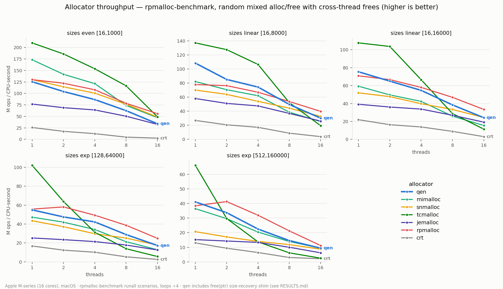
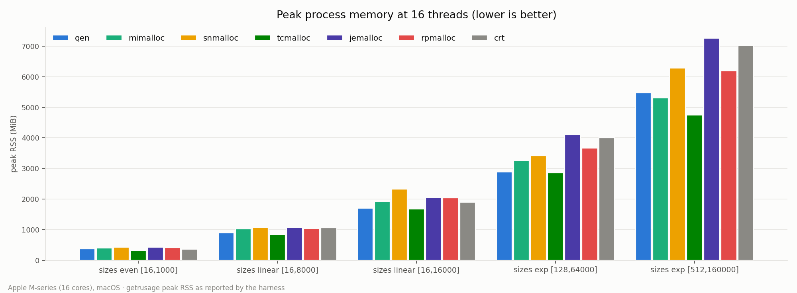

# qen vs. other allocators — rpmalloc-benchmark results

**Suite:** [rpmalloc-benchmark](https://github.com/mjansson/rpmalloc-benchmark)
(mjansson, commit `cada56d`, 2026-06-29) — an established allocator benchmark
that drives random mixed alloc/free workloads with cross-thread frees through
a small per-allocator adapter API. Scenarios are the suite's own `runall.sh`
random-mode matrix with loop counts scaled down 4× **uniformly across all
allocators** (identical relative workload); thread counts fitted to this
machine.

**Machine:** Apple M4 Max (16 cores), 64 GiB, macOS 15.4.1, 16 KiB pages.
Apple clang 17, `-O3 -DNDEBUG`; qen via rustc 1.95.0-nightly, `--release`,
fat LTO.

**Allocators:**

| name | version | source |
|---|---|---|
| qen | this tree | Rust staticlib via `bench/qen-adapter` |
| mimalloc | 3.3.2 | Homebrew |
| jemalloc | 5.3.0 | Homebrew (binding verified via `mallctl("version")`) |
| tcmalloc | gperftools 2.18.1 (`libtcmalloc_minimal`) | Homebrew |
| snmalloc | 0.7.1 | source, static shim (`sn_` prefix) |
| rpmalloc | vendored in the suite | suite source |
| crt | macOS system malloc (libmalloc) | system |

Note: the tcmalloc here is **gperftools**, not google/tcmalloc ("internal
tcmalloc") — the latter's per-CPU rseq front end is Linux-only. The roadmap
against the internal version is [ROADMAP-sota.md](./ROADMAP-sota.md).

## Disclosure: the adapter coherence-storm bug (fixed 2026-07-07)

Every qen multi-thread number published from this harness before
2026-07-07 was wrong — **capped by a bug in our own adapter, not by qen**.
`benchmark_malloc` stored a representative size into the span table on
*every* allocation; ~26 active pool spans pack into 2–4 cache lines, so
every thread wrote those lines per-alloc and read them per-free — a
cross-cluster coherence storm that serialized the whole process to
~9 M ops/CPU-s at 16 threads *regardless of workload* (flat across a 50×
working-set range, all size classes, and even with cross-thread frees
disabled). The fix is a first-touch-only store. Effect on scenario 1
alone: 16t 8.9 → 33.9 M (3.8×), 8t 2.6×, 4t +53%, single-thread and peak
RSS unchanged.

Consequences drawn honestly:

- **All qen numbers at ≥ 4 threads from earlier runs are invalid** (the
  tainted runs are preserved in
  [`results-adapterbug-items123/`](results-adapterbug-items123/) and
  [`results-baseline-pre-items123/`](results-baseline-pre-items123/)).
  Single-thread numbers stand: a same-core store causes no coherence
  traffic.
- The first-run diagnosis of a "16-thread recycler coherence storm" in
  [tcmalloc-analysis.md](./tcmalloc-analysis.md) was measuring this
  artifact; see the correction there. Three remote-free designs were
  evaluated against that phantom before differential profiling isolated
  the adapter (each was killed cheaply by a pre-committed falsification
  test — the discipline that eventually cornered the real cause).
- Multi-thread *before/after* claims for allocator changes (items 1–3)
  cannot be reconstructed retroactively — both sides of those comparisons
  ran under the cap. The 1-thread before/after story below is unaffected.

## Items 1–3: single-thread before/after (valid across the bug)

Between the baseline run and this one, three allocator changes landed
(motivated by the first-run analysis): a flattened hot path, adaptive
thread caches with chain refills and a 16 MiB byte-budget scavenge, and
256 KiB size classes with an exact-fit large cache (which also fixed a
real leak: the old power-of-two scheme could serve an oversized block
whose layout-sized free partially unmapped the reservation).

qen at 1 thread, baseline → current (M ops/CPU-s):

| scenario | 1t |
|---|---|
| even [16,1000] | 89.3 → **125.4** (+40%) |
| linear [16,8000] | 74.8 → **108.5** (+45%) |
| linear [16,16000] | 62.7 → **75.4** (+20%) |
| exp [128,64000] | 46.4 → **54.9** (+18%) |
| exp [512,160000] | 0.9 → **41.1** (46×) |

## Throughput (clean run, 2026-07-07)



Memory ops per CPU-second (the suite's metric — normalizes by CPU time, so
it measures allocator efficiency rather than parallel wall-clock):

| scenario | qen @1t (rank) | qen @16t (rank) | best @16t |
|---|---|---|---|
| even [16,1000] | 125.4 (5th) | 33.9 (6th) | rpmalloc 55.9 |
| linear [16,8000] | 108.5 (**2nd**) | 30.2 (3rd) | rpmalloc 39.8 |
| linear [16,16000] | 75.4 (**2nd**) | 24.1 (≈2nd, tie snmalloc) | rpmalloc 33.4 |
| exp [128,64000] | 54.9 (≈2nd, tie rpmalloc) | 17.3 (≈2nd, tie snmalloc) | rpmalloc 24.9 |
| exp [512,160000] | 41.1 (**2nd**) | 9.4 (**2nd**) | rpmalloc 11.2 |

Reading:

- **Single-threaded**: second only to gperftools tcmalloc in four of five
  scenarios (S4 a statistical tie with rpmalloc); tcmalloc's remaining
  lead is 1.6–1.9×, concentrated in its ~12-instruction small-size hit
  path.
- **16 threads, the corrected story**: qen is **second or third of the
  field in every scenario past 1 KiB sizes** — 1.2–1.4× behind rpmalloc,
  ahead of or tied with snmalloc/mimalloc, and ahead of gperftools
  tcmalloc everywhere except the smallest-size scenario (tcmalloc's
  central free-list collapses as sizes grow: 49.1 → 2.5 M across the
  matrix while qen holds 33.9 → 9.4). The one real 16-thread weakness
  left is the smallest-size scenario (33.9 vs the pack's 47–56), and
  qen's scaling curve (125 → 34, a 3.7× per-CPU efficiency drop vs
  rpmalloc's 2.3×) is now ordinary contention-tuning territory — not the
  6× structural cliff the tainted data showed.
- **Scenario 5 remains fixed** (the item-3 exact-fit large cache): from
  46× behind the field single-threaded to second place at every thread
  count.

## Peak memory



qen posts the **lowest peak RSS of every allocator except gperftools
tcmalloc in all five scenarios at 16 threads** (e.g. 377 vs 400–421 MiB
for the moderns on the smallest sizes; 2887 vs 3263–4109 on
exp [128,64000]), and the smallest footprint outright at 1 thread. The
decommit-with-cooldown discipline holds under the corrected throughput.

## Follow-up analysis

- Why gperftools tcmalloc leads single-threaded, and where it collapses:
  [tcmalloc-analysis.md](./tcmalloc-analysis.md) — including the
  correction retracting its first-run 16-thread diagnosis.
- The road to **internal** (google/) tcmalloc:
  [ROADMAP-sota.md](./ROADMAP-sota.md), re-derived against the clean
  numbers.

## Reproducing

```sh
brew install mimalloc jemalloc gperftools cmake ninja
cd bench
git clone --depth 1 https://github.com/mjansson/rpmalloc-benchmark.git
git clone --depth 1 --branch 0.7.1 https://github.com/microsoft/snmalloc.git
./build.sh
./run.sh          # ~1 h; writes results/raw.log + per-run CSVs
python3 plot.py   # writes results/results.csv + the two PNGs
```

Full per-run data: [`results/results.csv`](results/results.csv).
Historical runs: `results-baseline-pre-items123/` (pre-items-1-3,
adapter-bugged ≥4t), `results-adapterbug-items123/` (post-items-1-3,
adapter-bugged ≥4t). The figures use a CVD-validated categorical palette
with fixed slot order.

## Caveats

- Qen resolves pool-backed `free(ptr)` calls through its internal masked-base
  class table (one mask plus a lock-free lookup). The adapter keeps an exact
  side map only for large and over-aligned allocations. Qen's numbers therefore
  include its size-free small-allocation front end; other allocators run their
  native `malloc/free` entry points.
- Single machine, single OS (macOS 16 KiB pages; Linux
  hugepage/THP/rseq behavior is unmeasured here).
- One run per cell; cross-run drift measured on unchanged allocators is
  ±2% median.
- The suite does not measure qen's arenas (`FrameArena`, `CommandArena`,
  `ChunkPool`), which bypass malloc-style bookkeeping entirely.
